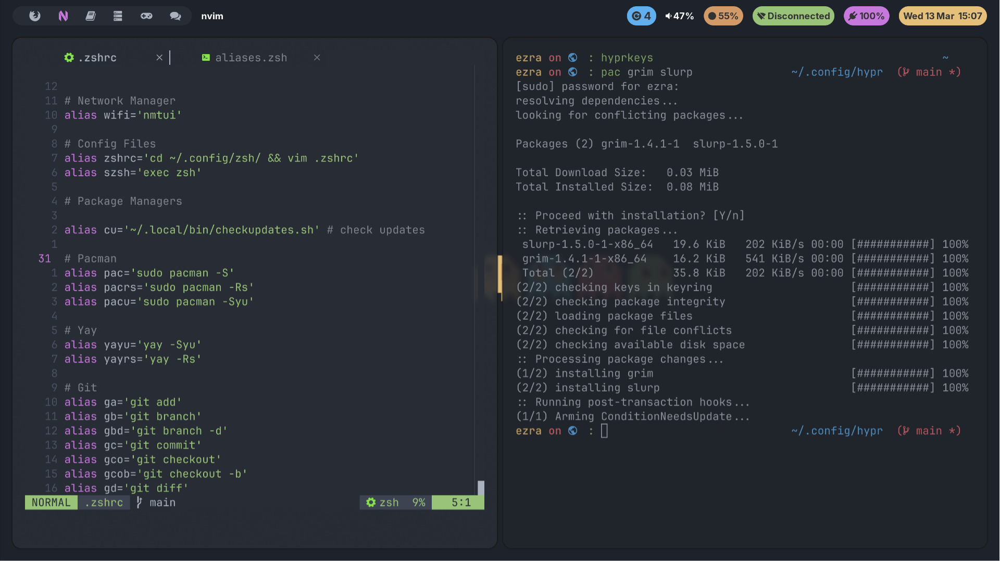

# .dotfiles 



## Install
Required
- `git`
- GNU `stow`
- `waybar` & `waybar-module-pacman-updates(AUR)`
- `rofi-wayland`
- `networkmanager-dmenu-git(AUR)`
- `hypr`, `hyprlock (AUR)`
- `nerd-fonts-inter(AUR)`
- `wezterm`
- `neovim`
- `ttf-jetbrains-mono-nerd`

Clone repo into `$HOME` or ~ directory

``` bash
git clone https://github.com/ezra-ramatong/.dotfiles.git ~/
```
Run `stow` to symlink directories to `.config` in your system

*symlink all directories except the README*

```bash
stow */ 
```
*symlink individual directory*
```bash
stow zsh 
```
## Install System Packages

Arch
```bash
sudo pacman -Syu
sudo pacman -S --needed - < ./pacman/packages.txt
```
AUR
```bash
yay -Syu
yay - < ./pacman/aur_packages.txt
```

